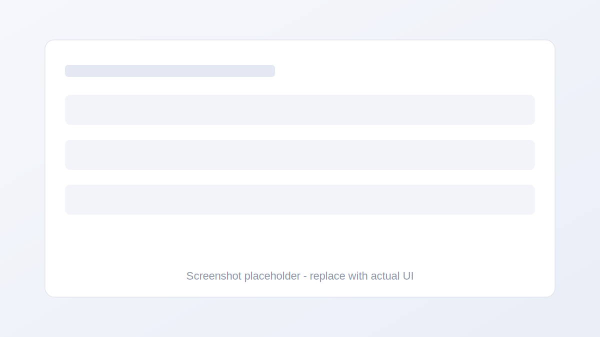

# Flashcards Trainer

A minimal, full-stack flashcards app with email/password auth and deck management.

## Overview
Flashcards Trainer is a simple learning companion: create an account, log in, and organize your study material into decks. It is built with a React client and an Express + SQLite API server.

## Features
- Email/password registration and login
- Session auth via HTTP-only cookies (JWT)
- Create and list decks
- SQLite persistence (local file database)

## Tech Stack
- Client: React (Create React App)
- Server: Express 5
- Database: SQLite (better-sqlite3)
- Auth: JWT + cookies
- Validation: Zod

## Project Structure
- client/: React app
- server/: Express API + SQLite database

## Quick Start

### 1) Install dependencies

```bash
cd server
npm install

cd ../client
npm install
```

### 2) Configure environment (server)
Create a `.env` file in `server/`:

```bash
PORT=4000
JWT_SECRET=change-me
HTTPS=false
```

Notes:
- `HTTPS=true` marks auth cookies as secure. Use it in production over HTTPS.
- The server creates `flashcards.db` automatically on first run.

### 3) Run the server

```bash
cd server
npm run dev
```

Server starts on http://localhost:4000

### 4) Run the client

```bash
cd client
npm start
```

Client starts on http://localhost:3000

## Branding & Screenshots
Replace the placeholder image in `docs/screenshot.svg` with a real UI screenshot when available.



## CORS / Dev Port Note
The server allows requests from `http://localhost:3000` in CORS. If you run the client on a different port, update the CORS origin in `server/src/index.js`.

## API Endpoints

Base URL: `http://localhost:4000/api`

Auth
- `POST /auth/register` { email, password }
- `POST /auth/login` { email, password }
- `POST /auth/logout`
- `GET /auth/me`

Decks (requires auth)
- `POST /decks` { name }
- `GET /decks`
- `GET /decks/:id`
- `DELETE /decks/:id`

## Scripts

Server (in `server/`):
- `npm run dev` - start server with nodemon
- `npm start` - start server

Client (in `client/`):
- `npm start` - start client
- `npm run build` - build production bundle
- `npm test` - run tests

## License
Not specified.
